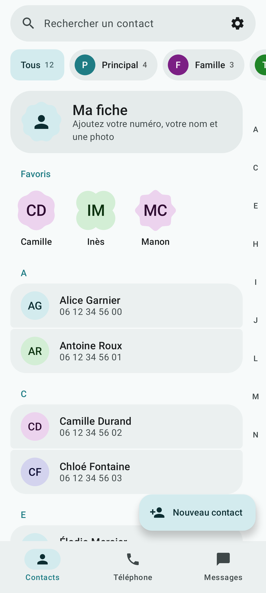
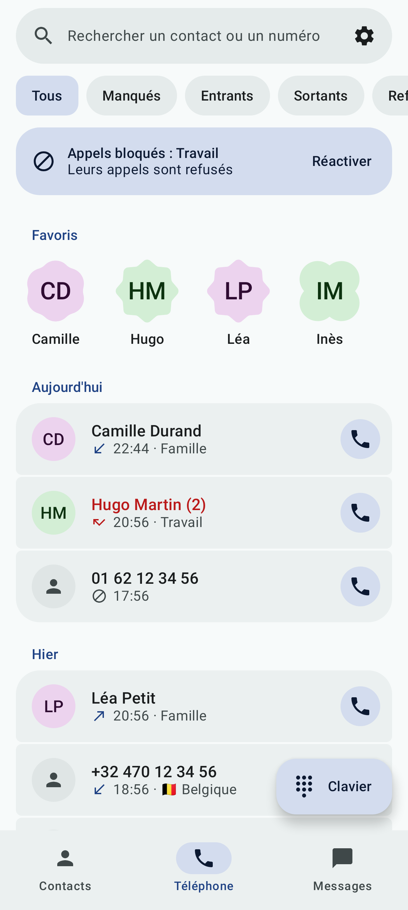
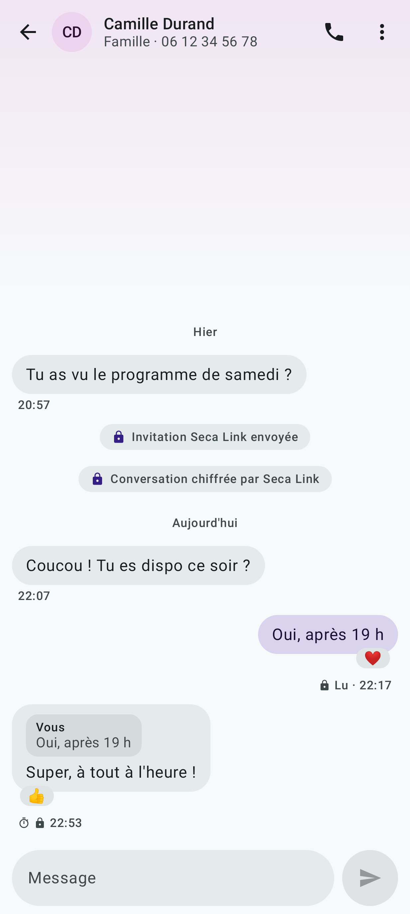

# Seca

Three communication apps for Android: **Seca Contacts**, **Seca Phone** and
**Seca Messages**. One Material 3 Expressive design, privacy first, no Google
dependency. They run on any phone with Android 12 or newer, and are at their best
on [GrapheneOS](https://grapheneos.org). The apps speak English and French,
following the phone's language.

| Seca Contacts | Seca Phone | Seca Messages |
|---|---|---|
|  |  |  |

## The apps

**Seca Contacts**: the address book, in Android's own contacts.
Colored profiles (Family, Work…) shared with the other two apps, favorites,
search, duplicate merging, your own card shared by QR code, vCard import and
export that keeps each contact's profile, encrypted backup. No Internet permission.

**Seca Phone**: calls.
A call screen showing the caller's profile, T9 search, telemarketing blocking
(the number ranges reserved for it in France), unknown callers silenced, profiles
blocked for a chosen time, a remembered SIM for each contact, declining a call
with a message, named audio and Bluetooth outputs. No Internet permission.

**Seca Messages**: texts, and Seca Link.
Conversations in the colors of the contact's profile, scheduled messages,
verification codes erased after a delay, advertising texts filed away, encrypted
backup. And, between Seca phones, **Seca Link**.

From any of the three, a **suite backup** gathers contacts and profiles, call
history and filtering, texts, conversations and settings into a single encrypted
file, to move to a new phone.

## Seca Link

End-to-end encrypted messaging between Seca phones, with no account and no Seca
server.

- The encryption is Signal's: [libsignal](https://github.com/signalapp/libsignal),
  with the post-quantum PQXDH key agreement.
- Encrypted messages travel through public [Nostr](https://nostr.com) relays.
  Each envelope is signed by a throwaway key: a relay sees who receives, when and
  roughly how much, never who writes nor what is written.
- Two phones connect by exchanging an invitation by SMS, or by scanning each
  other's code in person.
- Read receipts, typing indicator, reactions, quoted replies, encrypted photos and
  voice messages, disappearing messages, a safety number to compare.
- A Tor option with [Orbot](https://orbot.app): relays no longer see the phone's
  address.
- Off by default. Without Seca Link, Seca Messages does not use the Internet.

## Privacy

- No analytics, no crash reporting, no trackers.
- Seca Contacts and Seca Phone do not have the `INTERNET` permission: they cannot
  send anything anywhere.
- Each app checks at build time that no `com.google.android.gms`,
  `com.google.firebase` or `com.google.android.play` artifact reaches its runtime:
  the `verifyReleaseNoProprietaryDependencies` task, wired into `check`, fails the
  build otherwise.
- Seca Contacts' profiles can only be read by apps signed with the same key.

## What Seca does not do

- **No RCS.** Google keeps its RCS API to a closed list of apps.
- **No Wi-Fi calling as such.** VoWiFi belongs to the system's IMS stack and works
  whatever the dialer; Seca Phone shows its state.

## Which phone?

Any phone with Android 12 or newer: Samsung, Xiaomi, OnePlus, Fairphone, Pixel…
Seca needs neither Google Play nor Google services, and uses neither when they are
there.

[GrapheneOS](https://grapheneos.org) is recommended, not required. Seca keeps what
it handles on the phone whatever the system, but only a system without Google keeps
the rest of the phone as discreet. GrapheneOS also brings features Seca makes use
of: Contact Scopes, a network permission for each app, and a hardened system.

On other phones:

- Seca Link receives through its own connection to the relays, not through Google's
  push service. Let Seca Messages run in the background when it asks. Some brands
  (Xiaomi, Huawei, Oppo, Samsung…) add their own battery or autostart settings on
  top: [dontkillmyapp.com](https://dontkillmyapp.com) explains them brand by brand.

## Install

Seca is **in beta**. Until it reaches F-Droid, releases are published on
[GitHub Releases](https://github.com/arditore/Seca/releases): install the three
APKs, then choose Seca Phone as the Phone app and Seca Messages as the SMS app.

The APKs are signed with this certificate (SHA-256 fingerprint):

```
2F:DE:A7:B4:6B:EF:FE:16:45:9B:B4:DC:DD:34:DB:5E:0C:B9:12:27:4A:5E:B6:28:E4:B0:D8:A5:96:21:17:90
```

## Build

Requirements: JDK 17 and the Android SDK (platform `android-37`, build-tools 36.0.0).
The Seca Link tests also need a JDK 25, which Gradle finds by itself.

```bash
./gradlew :apps:contacts:assembleDebug :apps:phone:assembleDebug :apps:messages:assembleDebug
./gradlew test
./gradlew check
```

To draw the main screens with sample data (the screenshots of this README and of
the F-Droid listings):

```bash
SECA_SCREENSHOTS=build/captures ./gradlew testDebugUnitTest --tests "*ScreenshotsTest"
```

## License

[GPL-3.0-or-later](LICENSE).
